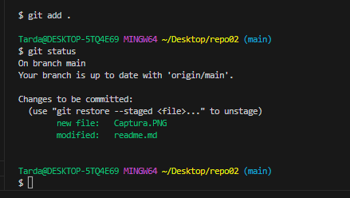

# Explicacion de Git
Git es una herramienta que podemos usar como repositorio local y remoto.
Una de sus funciones es poder visualizar los distintos cambios que vamos realizando en un proyecto a lo largo del tiempo.
Como por ejemplo quien ha echo las modificaciones en su momento ¡ o acceder al codigo de un momento especifico del proyecto para corregir un fallo.

# Comando de git

+  Primero que todo debemos conocer el comando " git init" el cual es el que nos permite la creacion de un repositorio. Pero para ello debemos asegurarnos en nuestra consola que estamos situados sobre nuestro escritorio. Con los comandos "cd desktop"
+  
  

* Una vez dentro crearemos nuestro repositorio y empezaremos con nuestra introduccion de datos.

Añadiremos los cambios que vayamos realizando con el commando "git add ."
para que nuestros archivos dejen el working directory y dejen de aparecernos untracked. Y comprobaremos el estado de nuestros archios con "git status". 

+ El comando *git commit -m*  nos permitira crear un snapshot para que comparemos nuestros avances. *Como realizar un guardado y continuar* y no un guardado y sobreescribir.
  
  

 - Una vez lo tengamos todo preparado podemos usar el comando "Git push" para subir los datos a nuestro escritorio remoto. Siempre y cuando lo hayamos enlazado correctamente antes y comprobado el enlace con *git remote -v* 
 - 

## Comandos varios

Podemos usar infinidad de comandos. Como por ejemplo *git rm* (remove)
el cual nos permitira borrar los archivos que seleccionemos porque ya no los necesitemos. O git log que nos permitira ver la cantidad de commits creados.

